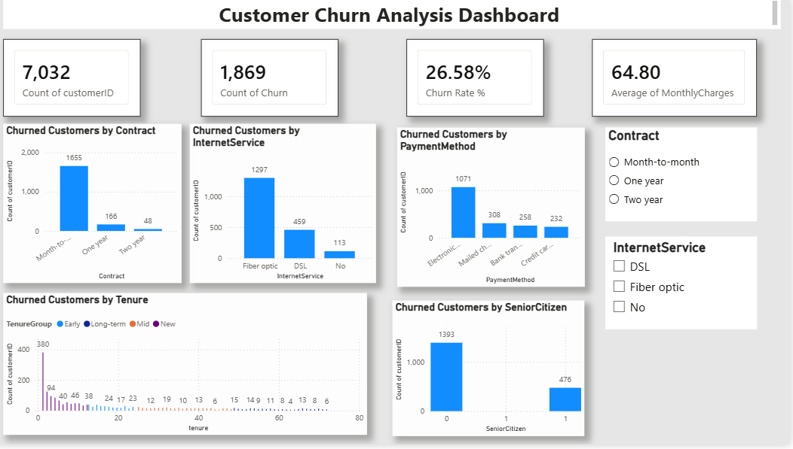

# Customer Churn Analysis

## Project Overview

This project analyzes customer churn to identify patterns and factors associated with customer attrition. The analysis was performed using Python, SQL, and Power BI.

## Business Objective

The objective is to understand customer churn patterns across contract types, internet services, payment methods, tenure groups, and customer segments.

## Dataset

- Total customers: 7,032
- Columns: 21
- Duplicate records: 0
- Churned customers: 1,869
- Overall churn rate: 26.58%

## Data Cleaning

Using Python and Pandas, the dataset was:
- Checked for duplicate records
- Checked for missing values
- Cleaned and prepared for analysis
- Exported as a cleaned CSV file

## SQL Analysis

SQL was used to answer business questions related to customer churn, including:
- Customer counts
- Churn analysis
- Average monthly charges
- Contract analysis
- Internet service analysis
- Payment method analysis

## Power BI Dashboard

An interactive Power BI dashboard was created to analyze:
- Total customers
- Churned customers
- Churn rate
- Average monthly charges
- Churn by contract
- Churn by internet service
- Churn by payment method
- Churn by tenure group
- Churn by senior citizen status

## Key Insights

- 1,869 customers churned, representing an overall churn rate of 26.58%.
- Month-to-month contract customers accounted for the largest number of churned customers.
- Electronic check customers represented the largest number of churned customers by payment method.
- Non-senior citizens accounted for 1,393 churned customers, while senior citizens accounted for 476.

## Tools Used

- Python
- Pandas
- SQL
- MySQL
- Power BI
- DAX

## Project Files

- `customer_churn_cleaned.csv` — Cleaned dataset
- `Customer_Churn_Analysis.ipynb` — Python analysis
- `customer_churn.sql` — SQL queries
- `Customer_Churn_Analysis.pbix` — Power BI dashboard

## Power BI Dashboard

